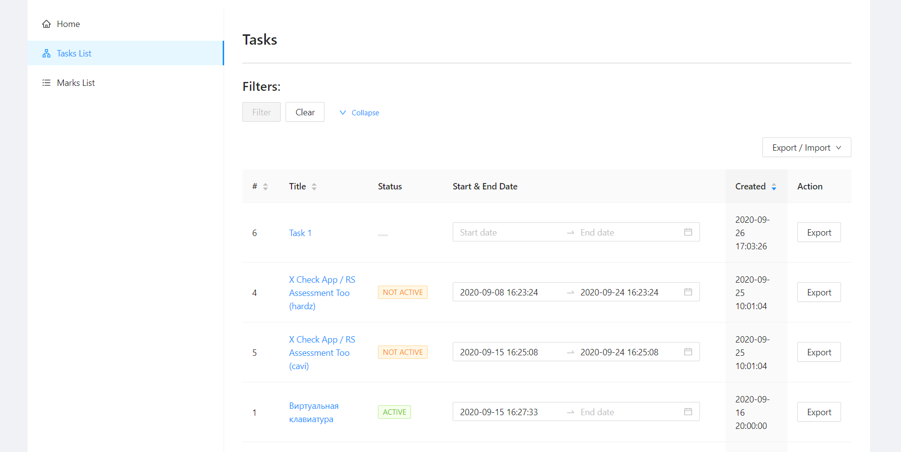

  

# X Check App

## Назначение и условия применения

**Область применения.** Образовательный процесс.
**X-Check App** – веб-система целью которой является автоматизация процессов, связанных с управлением задачами (task managment), самопроверка и проверка преподавателем (ментором) результатов работы, кросс-чек сессии, обратная связь в ходе учебного процесса и т.д..

**Краткое описание возможностей.** Набор операций по работе с веб-системой распределяется между функциональными группами следующим образом:
- **Автор (author)**
  - CRUD tasks - (создание / просмотр / редактирование / удаление) заданий
  - CRUD categories - (создание / просмотр / редактирование / удаление) категорий заданий
  - Export / Import задач
- **Студент (student)**
  - Самопроверка выполненного задания(-ий)
  - (Создание / редактирование) запроса(-ов) на проверку:
    - Ментор
    - Cross-Check **(в разработке)**
  - Cross-Check Review **(в разработке)**
  - Обратная связь с ментором (результаты проверки и возможность апелляции)
- **Ментор (supervisor)**
  - Рассмотрение запросов на проверку заданий от студентов
  - Разрешение споров (апелляций)
- **Курс-менеджер (courseManager)**
  - Export задач
  - Выставление дедлайна на определенную задачу
  - Просмотр статистики (истории) о выполнении (сдачи) заданий
  
**Уровень подготовки пользователя.** Пользователь **X-Check App** должен обладать следующей квалификацией:
-	пользовательские навыки в работе с любой OC;
-	пользовательские навыки работы с любым современным веб-браузером.

**Требования к программному обеспечению**. Для корректной работы **X-Check App** следует использовать веб-браузеры, обеспечивающие полную совместимость со стандартами: HTML5, CSS 3.0 и JavaScript.
Рекомендуемое программное обеспечение:
- **ОС:**	MS Windows, Linux, Mac OS
- **Веб-браузеры:**	Firefox 80+, Opera 68+, Google Chrome 85+ и другие браузеры последней версии

**Запуск системы.** Доступ к веб-сервису **X-Check App** осуществляется интерактивно через сеть Интернет посредством обращения по адресу: **[ссылка](https://brave-banach-54e725.netlify.app/)**.

**Вход в систему.** Процесс входа производится через GitHub аккаунт с предварительным выбором роли, которая будет в дальнейшем использоваться для входа в персональный раздел.

# Автор (author)

### Главная страница

### Страница со списком всех заданий автора

Функциональные фозможности:
- Переход на страницу просмотра задачи (клик по заголовку задачи)
- Переход на страницу редактирование задачи (клик по иконке редактирования)
- Удаление задачи (клик по иконке удаления)
- Переход на страницу создания категории текущей задачи (клик по кнопке [+Add])
- Export / Import как одной так и нескольких задач (собственный формат | формат RSS)

### Страница создания задачи

Функциональные фозможности:
- Создание задачи (заполнение полей):
  - Заголовок (title)*
  - Статус (DRAFT) - по умолчанию, пока у задачи нет категории
  - Описание (description) с возможностью форматирования текста (вставка ссылок, списков, таблиц и тд.)

### Страница редактирования задачи

Функциональные фозможности:
- Редактирование задачи (заполнение полей):
  - Заголовок (title)*
  - Статус задачи (DRAFT | PUBLISHED | ARCHIVE)
  - Описание (description) с возможностью форматирования текста (вставка ссылок, списков, таблиц и тд.)
- Список категорий текущей задачи:
  - Переход к созданию категории
  - Переход к редактированию категории
  - Удаление категории

### Страница создания (редактирования) категории

Функциональные фозможности:
- Создание (редактирования) категории (заполнение полей):
  - Заголовок (title)*
  - Описание (description) с возможностью форматирования текста (вставка ссылок, списков, таблиц и тд.)
  - Добавление критерий (изменение существующих):
    - Доступность (Всем | Ментору | Студенту)
    - Оценка (положительное | отрицательное число)
    - Текст критерия

- Sent Requests

### Course Manager

- Marks List

- Task List

## For Work

- For running : npm start

- For testing : npm test

- For prod building : npm build

- Lint : npm lint

- Eject: npm eject

## Built with

-  [Create React App](https://github.com/facebook/create-react-app) - This project (X Check App) was bootstrapped with Create React App.

-  [Antd](http://getbootstrap.com/) -  React UI library antd that contains a set of high quality components and demos for building rich, interactive user interfaces.

-  [React](https://reactjs.org/) - A JavaScript library for building user interfaces.

-  [Redux](https://redux.js.org/) - A Predictable State Container for JS Apps.

-  [Redux-saga](https://redux-saga.js.org/) - is a library that aims to make application side effects (i.e. asynchronous things like data fetching and impure things like accessing the browser cache) easier to manage, more efficient to execute, easy to test, and better at handling failures.

-  [EsLint](https://eslint.org/) - ESLint is a tool for identifying and reporting on patterns found in ECMAScript/JavaScript code, with the goal of making code more consistent and avoiding bugs.

## Team
The RsLang app was created by a team of RSSchool students as a learning project.

# [Rolling Scopes School ](https://rs.school/)
