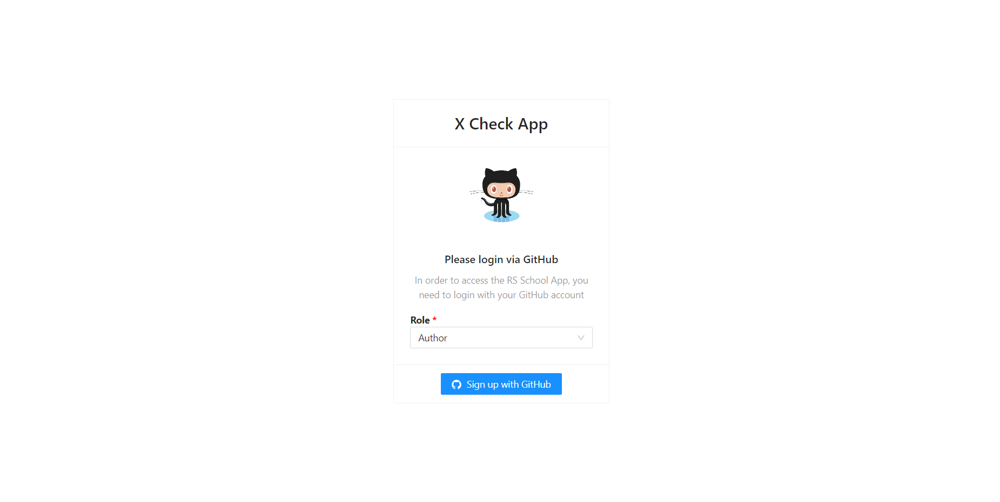
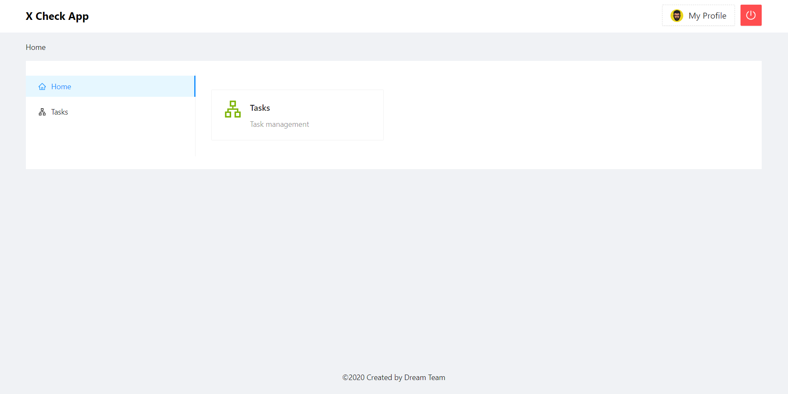
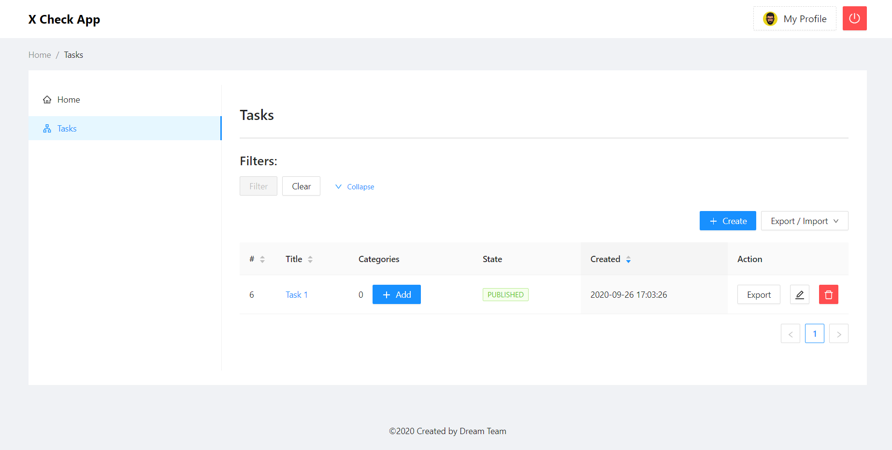
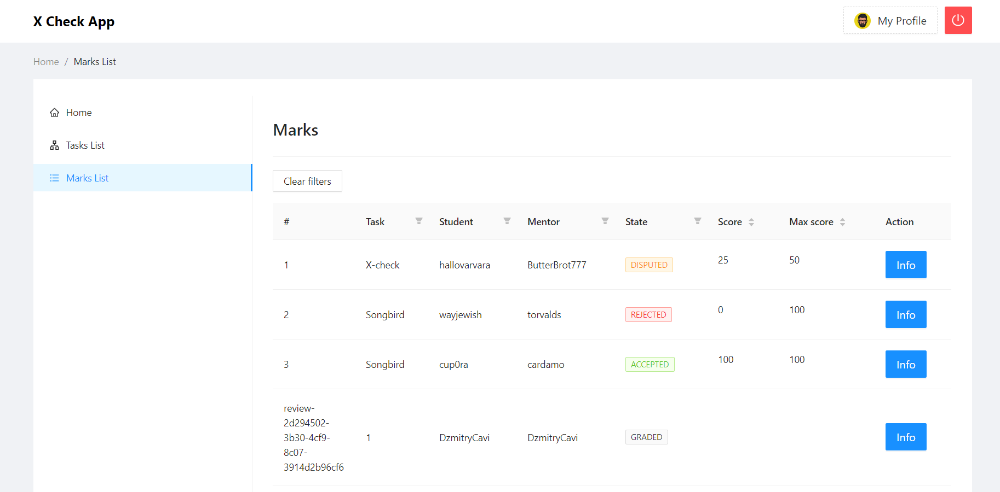

  

# X Check App

## Назначение и условия применения

**Область применения.** Образовательный процесс.
**X-Check App** – веб-система целью которой является автоматизация процессов, связанных с управлением задачами (task managment), самопроверка и проверка преподавателем (ментором) результатов работы, кросс-чек сессии, обратная связь в ходе учебного процесса и т.д..

**Краткое описание возможностей.** Набор операций по работе с веб-системой распределяется между функциональными группами следующим образом:
- **Автор (author)**
  - CRUD tasks - (создание / просмотр / редактирование / удаление) заданий
  - CRUD categories - (создание / просмотр / редактирование / удаление) категорий заданий
  - Export / Import задач
- **Студент (student)**
  - Самопроверка выполненного задания(-ий)
  - (Создание / редактирование) запроса(-ов) на проверку:
    - Ментор
    - Cross-Check **(в разработке)**
  - Cross-Check Review **(в разработке)**
  - Обратная связь с ментором (результаты проверки и возможность апелляции)
- **Ментор (supervisor)**
  - Рассмотрение запросов на проверку заданий от студентов
  - Разрешение споров (апелляций)
- **Курс-менеджер (courseManager)**
  - Export задач
  - Выставление дедлайна на определенную задачу
  - Просмотр статистики (истории) о выполнении (сдачи) заданий
  
**Уровень подготовки пользователя.** Пользователь **X-Check App** должен обладать следующей квалификацией:
-	пользовательские навыки в работе с любой OC;
-	пользовательские навыки работы с любым современным веб-браузером.

**Требования к программному обеспечению**. Для корректной работы **X-Check App** следует использовать веб-браузеры, обеспечивающие полную совместимость со стандартами: HTML5, CSS 3.0 и JavaScript.
Рекомендуемое программное обеспечение:
- **ОС:**	MS Windows, Linux, Mac OS
- **Веб-браузеры:**	Firefox 80+, Opera 68+, Google Chrome 85+ и другие браузеры последней версии

**Запуск системы.** Доступ к веб-сервису **X-Check App** осуществляется интерактивно через сеть Интернет посредством обращения по адресу: **[ссылка](https://brave-banach-54e725.netlify.app/)**.

**Вход в систему.** Процесс входа производится через GitHub аккаунт с предварительным выбором роли, которая будет в дальнейшем использоваться для входа в персональный раздел.

# Автор (author)

### Главная страница

### Страница со списком всех заданий автора

Функциональные фозможности:
- Фильтрация заданий (по имени и статусу), сортировка по полям
- Переход на страницу просмотра задачи (клик по заголовку задачи)
- Переход на страницу редактирование задачи (клик по иконке редактирования)
- Удаление задачи (клик по иконке удаления)
- Переход на страницу создания категории текущей задачи (клик по кнопке [+Add])
- Export / Import как одной так и нескольких задач (собственный формат | формат RSS)

### Страница создания задачи

Функциональные фозможности:
- Создание задачи (заполнение полей):
  - Заголовок (title)*
  - Статус (DRAFT) - по умолчанию, пока у задачи нет категории
  - Описание (description) с возможностью форматирования текста (вставка ссылок, списков, таблиц и тд.)

### Страница редактирования задачи

Функциональные фозможности:
- Редактирование задачи (заполнение полей):
  - Заголовок (title)*
  - Статус задачи (DRAFT | PUBLISHED | ARCHIVE)
  - Описание (description) с возможностью форматирования текста (вставка ссылок, списков, таблиц и тд.)
- Список категорий текущей задачи:
  - Переход к созданию категории
  - Переход к редактированию категории
  - Удаление категории

### Страница создания (редактирования) категории

Функциональные фозможности:
- Создание (редактирования) категории (заполнение полей):
  - Заголовок (title)*
  - Описание (description) с возможностью форматирования текста (вставка ссылок, списков, таблиц и тд.)
  - Добавление критерий (изменение существующих):
    - Доступность (Всем | Ментору | Студенту)
    - Оценка (положительное | отрицательное число)
    - Текст критерия

# Курс-менеджер (courseManager)

### Страница со списком всех опубликованных заданий (Tasks List)

Функциональные фозможности:
- Фильтрация заданий (по имени и статусу), сортировка по полям
- Переход на страницу детального просмотра

### Страница со списком результатов проверкок (Marks List)

Функциональные фозможности:
- Фильтрация заданий и сортировка по полям
- Переход на страницу просмотра задачи (клик по заголовку задачи)
- Выставления временных ограничений (выдача заданий на выполнение - startDate & endDate)
- Export как одной так и нескольких задач (собственный формат | формат RSS)

# Студент (student)
### Страница навигации (Home)
  Функциональные фозможности:
- Переход к странице создания запроса на проверку
- Переход к списку созданных запросов 

### Страница создания / изменения запроса (Create Request)
  Функциональные фозможности:
- Выбор задания для создания запроса на его проверку (доступны только начатые, опубликованные задания у которых не настал дедлайн)
- Создание запроса 
  - Текстовое поле для вставки ссылки на выполнение (Валидация по патеррну взятому из приложения RSS)
  - Форма самопроверки 
    - Каждому пункту задания можно выставить оценку кликнув по кнопкам быстрой оценки (MIN | HALF | MAX) или введя значение вручную (текстовое принимает только числа в заданных приделах). При выставлении оценки ниже максимально открывается обязательное поле для коментария своего выбора с предустановленным коментарием, который можно дополнить или заменить.
    - Автоматический подсчет суммы балов возле кнопки отправки
 - Сохранене данных без отправки запроса (запрос сохраняется в статусе DRAFT, при следующем открытии этого запроса откроется форма с заполненными полями)
 - Отправка запроса (невозможно отправить запрос без самопроверки)
 
 Выбор задания
 
 
 Прмер Формы 1
 
 
 Пример формы 2
 
 

### Страница со списком запросов (Requests list)
Функциональные фозможности:
- Просмотр списка всех существующих запросов пользователя
  - Возможна фильтрация по имени и статусу (DRAFT | SUBMITTED | GRADED)
  - Возможна сортировка
- Переход к странице просмотра и редактирования запросов (клик по кнопке редактирования запроса)
- Удаление неотправленных запросов (кнопка удаления)
- Переход к странице просмотра оценки (кнопка view появляется у запросов в статусе GRADED)
 
 Список запросов
 
 
 ### Страница просмотра оценки задачи (GRADE)
 Функциональные фозможности:
- Просмотр общего бала и процента выпонения задания
- Просотр подробной оценки по каждому пункту
  -Самооценка и коментарий
  -Оценка ментора и коментарий
- Возможность открытия спора по каждому пункту (По нажатию на кнопку Dispute, октрывается поле для описания проблемы)
- Если существует хотябы один спорный пункт то появляется кнопка "OPEN DISPUTE" (открыть спор) иначе появляется кнопка "ACCEPT"(принять оценку)

Вид страницы 

Спор открыт

Спора нет

# Ментор (supervisor)

Пишем... :)

## For Work

- For running : npm start

- For testing : npm test

- For prod building : npm build

- Lint : npm lint

- Eject: npm eject

## Built with

-  [Create React App](https://github.com/facebook/create-react-app) - This project (X Check App) was bootstrapped with Create React App.

-  [Antd](http://getbootstrap.com/) -  React UI library antd that contains a set of high quality components and demos for building rich, interactive user interfaces.

-  [React](https://reactjs.org/) - A JavaScript library for building user interfaces.

-  [Redux](https://redux.js.org/) - A Predictable State Container for JS Apps.

-  [Redux-saga](https://redux-saga.js.org/) - is a library that aims to make application side effects (i.e. asynchronous things like data fetching and impure things like accessing the browser cache) easier to manage, more efficient to execute, easy to test, and better at handling failures.

-  [EsLint](https://eslint.org/) - ESLint is a tool for identifying and reporting on patterns found in ECMAScript/JavaScript code, with the goal of making code more consistent and avoiding bugs.

## Team
The RsLang app was created by a team of RSSchool students as a learning project.

# [Rolling Scopes School ](https://rs.school/)

